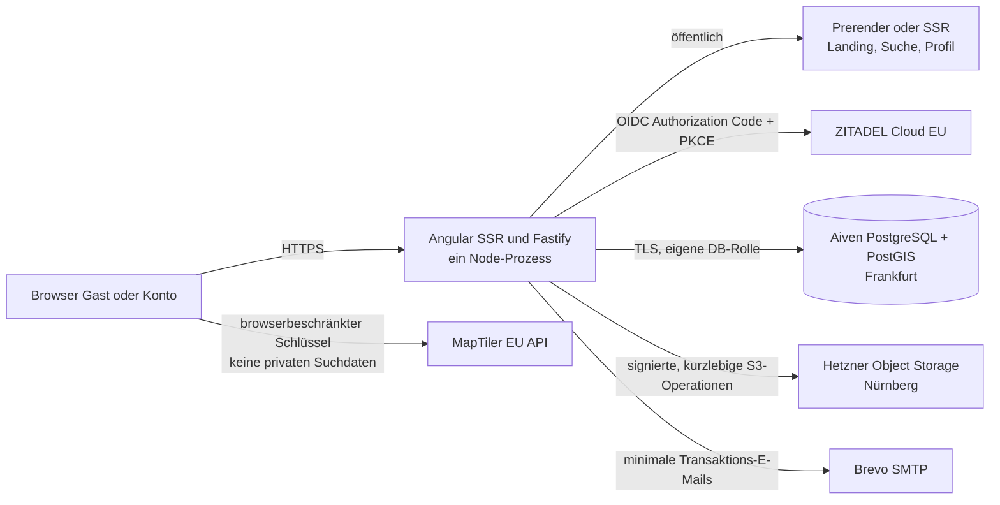

# ADR-001 · Modularer TypeScript-Monolith für AutoKosova

**Status:** für die Grundlagenphase angenommen · **Datum:** 13. September 2026
**Entscheidung:** eine Angular-Anwendung mit Hybrid Rendering und ein Fastify-API-Server laufen als ein TypeScript-Produkt in einem Repository und einem Node.js-Prozess. PostgreSQL mit PostGIS ist die einzige fachliche Datenquelle.

## Kontext

AutoKosova braucht öffentlich auffindbare Werkstattprofile, eine mobil nutzbare Suche und private, streng berechtigte Daten für Fahrzeuge, Reparaturanfragen, Besuchsnachweise und Moderation. Der Betreiber kennt Angular. Für den Pilot gibt es weder einen Grund für mehrere Dienste noch eine Freigabe für Produktivkauf, Domain oder öffentliche Bereitstellung.

Die Entscheidungen in diesem ADR sind Arbeitsentscheidungen. Sie erlauben #7 und #8, aber keine Bestellung, kein Konto bei einem Anbieter und keinen öffentlichen Pilot. Versionen und konkrete Tarifdetails werden beim Bootstrap gegen die jeweiligen Herstellerdokumentationen geprüft.

## Entscheidung

### Produkt und Laufzeit

| Baustein | Festlegung | Begründung |
|---|---|---|
| Sprache und Laufzeit | TypeScript auf Node.js 24 LTS; nur aktive oder Maintenance-LTS-Versionen zulassen | Eine Sprache für UI, API und Tests; Node empfiehlt für Produktion LTS-Releases. |
| Web und öffentliche Seiten | Aktuelles stabiles Angular mit `@angular/ssr`; öffentliche Landing-, Ergebnis- und Profilrouten werden prerendered oder serverseitig gerendert, private Bereiche clientseitig nach Authentifizierung | Angular unterstützt Hybrid Rendering für SSR, Prerendering und CSR. Das liefert HTML für Suche und vermeidet das Cachen privater Inhalte. |
| HTTP und API | Fastify 5 mit TypeBox/JSON-Schema an jeder Ein- und Ausgabe; `/api/*` vor dem Angular-Handler registrieren | Schema-Validierung begrenzt Eingaben und Antworten; Fastify lässt sich direkt mit Angulars Node-Handler verbinden. |
| Datenzugriff | `pg` mit versionierten SQL-Migrationen und einer kleinen Repository-Schicht; keine räumlichen Abfragen im Client und kein ORM, das PostGIS versteckt | PostGIS und Berechtigungsabfragen bleiben explizit prüfbar. |
| Datenbank | Managed Aiven for PostgreSQL in `google-europe-west3` (Frankfurt) mit PostGIS, TLS und getrennten Rollen | PostGIS ist dort unterstützt; Aiven bietet eine Region in Frankfurt sowie automatische Backups mit WAL-Archivierung. |
| App-Hosting | Ein Hetzner-Cloud-Host in Nürnberg mit einem unveränderlichen App-Container und TLS-Reverse-Proxy; kein Kubernetes, kein Event-Bus | Wenige Betriebsbausteine, deutsche Region, klar reproduzierbarer Ersatz des App-Hosts. |

Angulars aktuelle SSR-API unterstützt einen Fastify-Handler; damit bleibt es ein HTTP-Prozess statt zweier unabhängig zu betreibender Anwendungen. Öffentliche Routen erhalten keine Benutzer-, Cookie- oder privaten Request-Daten in Transfer-Cache oder CDN-Cache. Der Angular-Host- und Proxy-Header-Allowlist wird explizit konfiguriert; `*` ist verboten.

### Eine verworfene Alternative

**Next.js als All-in-one-Produkt** wäre technisch möglich, wird aber verworfen. Es würde Angular-Erfahrung und die bereits abgestimmte UX-Richtung durch React-Wissen und einen zweiten UI-Stack ersetzen. Angular bietet die benötigte SSR-/Hybrid-Rendering-Funktion bereits; ein Frameworkwechsel bringt für dieses MVP keinen nachgewiesenen Nutzen.

## Modulgrenzen

Ein Repository und ein deploybares Produkt, aber klar getrennte Fachmodule:

- `identity`: OIDC-Sitzung, Tokenprüfung, Rollenabbildung; keine eigenen Passwörter.
- `workshops`: öffentliche Profildaten, Unternehmensprüfung und Mitgliedschaften.
- `catalog`: Leistungen, Fahrzeugklassen und gepflegte Ortsgrundlage.
- `search`: PostGIS-Abfragen, Filter und neutrale Relevanz; keine Bezahl- oder Vertrauensbevorzugung.
- `requests`: private Fahrzeuge, Reparaturanfragen, Suchgebiete und Kontaktabsichten.
- `reviews`: Besuchsnachweise, Bewertungen und öffentliche Darstellung getrennt verwalten.
- `moderation`: Meldungen, Entscheidungen und revisionsfähige Ereignisse.
- `files`: Quarantäne, Metadaten und autorisierte signierte Objektzugriffe.
- `notifications`: Datenbank-Outbox und E-Mail-Zustand; kein externer Queue- oder Event-Bus.

Eine Route ruft nur einen fachlichen Service auf. Services geben keine Datenbankzeilen direkt nach außen, und externe Provider werden ausschließlich über kleine Adapter angesprochen. Ein Fehler eines optionalen Adapters darf weder private Daten ausliefern noch eine öffentliche Qualitäts- oder Verfügbarkeitsaussage erfinden.

## Anbieter- und Betriebsentscheidung

| Bedarf | Gewählter Dienst und Datenort | Zugriff, Kosten und Ausfallverhalten | Harte Grenze |
|---|---|---|---|
| Authentifizierung | ZITADEL Cloud, bei Einrichtung **EU-Region** auswählen | OIDC/OAuth2, Passkeys und Audit-Ereignisse statt eigener Credential-Speicherung. Nutzung ist volumenabhängig; Tarif, DPA und Subprozessoren werden vor Bestellung live geprüft. Bei Ausfall bleiben geschützte Routen geschlossen; öffentliche Suche bleibt ohne Auth nutzbar. | Kein lokales Passwort, kein Admin-Self-Signup und keine aus Tokens abgeleiteten App-Rollen ohne Membership-Prüfung. ZITADEL weist darauf hin, dass Datenregion nicht garantiert, dass Transit nie außerhalb der Region erfolgt. |
| Anwendungs-Host | Hetzner Cloud, Nürnberg | Ein technisches Betreiberkonto mit MFA, getrennte Deploy-Schlüssel und Firewall. Preis vor Bestellung erfassen, nicht schätzen. App-Host ist ersetzbar aus Image und Konfiguration; ein einzelner Host ist keine HA-Zusage. | Keine Kundendaten in Image, Logs oder unverschlüsselten Host-Backups. Keine Produktivfreigabe ohne Wiederherstellungsprobe. |
| Relationale Daten und Geosuche | Aiven for PostgreSQL, `google-europe-west3` Frankfurt, PostGIS | App verbindet ausschließlich per TLS und eigener Minimalrolle. Planpreis und Netzwerkoptionen sind vor Bestellung zu bestätigen. Aiven dokumentiert tägliche Vollbackups und fortlaufend archivierte WAL-Segmente; das ersetzt keinen getesteten Restore. | Datenbankzugang nie an Browser ausgeben; Admin-/Migration-Rolle getrennt von Laufzeitrolle; keine räumliche Suche im Client. |
| Private Dateien | Hetzner Object Storage, Nürnberg | Ein Bucket je Umgebung, eigener S3-Schlüssel je Umgebung, private Objekte. Hetzner bietet Object Storage in Nürnberg, Falkenstein und Helsinki; Kosten und Lebenszyklus werden vor Bestellung festgelegt. | Kein öffentlicher Bucket, keine dauerhafte Objekt-URL und kein Upload ohne serverseitige Typ-/Größen-/Autorisierungsprüfung. |
| Karten und Geocoding | MapTiler Cloud über `api.maptiler.eu`, browserbeschränkter Public-Key | Der Schlüssel wird pro Anwendung und erlaubter Origin beschränkt und rotiert. MapTiler dokumentiert EU-Endpunkt und EU-/Schweiz-basierte Verarbeitung für passende Konfigurationen; Kostenlimit wird vor Aktivierung gesetzt. | Nie Reisezeitraum, Fahrzeug, Reparaturtext, Nachweis oder Identität an MapTiler senden. Keine Geocoder-Ergebnisse cachen oder weiterverteilen; dauerhafte Werkstattkoordinaten entstehen nur durch eigene, nachvollziehbare Eingabe/Prüfung. |
| Transaktionale E-Mail | Brevo SMTP | Nur Account-Wiederherstellung, Sicherheits- und Zustellhinweise; Nachricht enthält keinen privaten Reparaturtext, sondern einen Link zur Anwendung. Brevo dokumentiert Datenbankhaltung in der EU und SMTP-Relay. Tarif, DPA, Senderdomain und DKIM werden vor Aktivierung geprüft. | Kein Newsletter, keine automatische Werkstattwerbung und keine private Information im Betreff oder Log. |

Keiner dieser Dienste wird mit diesem ADR bestellt oder konfiguriert. Anbieterpreise, DPA, Auftragsverarbeitung, akzeptierte Zahlungsart, endgültiger Betreiber und Datenaufbewahrung bleiben vor Produktivstart zu bestätigen.

## Berechtigung und Sicherheit

1. Fastify verifiziert Issuer, Audience, Ablaufzeit und Signatur des OIDC-Token; die externe Subject-ID wird nur auf einen lokalen `User` abgebildet.
2. Jede schreibende Anfrage nutzt eine sichere, `HttpOnly`, `Secure`, `SameSite=Lax`-Sitzung und CSRF-Schutz. Ein API-Endpoint entscheidet serverseitig, nie anhand eines versteckten UI-Elements.
3. Fachservices prüfen Besitz oder aktive `Membership`. Die Datenbank erzwingt für private Tabellen Row-Level Security; jede Anfrage verwendet eine Transaktion mit `SET LOCAL app.user_id` und einer nicht privilegierten Laufzeitrolle.
4. Öffentliche Lesemodelle enthalten nur freigegebene Workshop-, Leistungs- und Bewertungsfelder. Private Dateien werden erst nach derselben Objektprüfung mit zeitlich enger signierter URL zugänglich.
5. Adminrechte entstehen nur durch einen dokumentierten Operator-Vorgang. Rollenänderungen, Moderationsentscheidungen und signierte Dateioperationen erzeugen ein unveränderbares `ModerationEvent` beziehungsweise Audit-Ereignis ohne Geheimnisse oder Beleginhalt.

Rate Limits gelten für Login-Callback, Suche, Kontaktabsicht, Upload-Metadaten und Meldungen. Sicherheitslogs enthalten IDs und Ereignistypen, nicht Freitext, Zugangstoken, Reisezeiten, Fahrzeugdetails oder Objekt-URLs.

## Daten, Backups und Wiederherstellung

- Aiven-Backups und WAL-Archivierung sind die erste Datenbank-Sicherung. Zusätzlich wird vor öffentlichem Pilot ein verschlüsselter, begrenzter logischer Export in den privaten Objekt-Backup-Prefix automatisiert; Schlüssel und Restorekonto sind getrennt vom Laufzeitkonto.
- Ein Restore-Test muss in eine leere, isolierte Umgebung erfolgen: Schema anwenden, Export einspielen, PostGIS-Indizes prüfen, einen privaten Objektzugriff verweigern und eine autorisierte Testdatei lesen. Ergebnis, Dauer und Datenstand werden dokumentiert.
- Das Ziel für den begrenzten Pilot wird erst mit Betreiber und Budget festgelegt; ohne dokumentierten erfolgreichen Restore gibt es keinen öffentlichen Pilot. Server-Snapshots sind nur ein Hilfsmittel und enthalten keine separaten Volumes automatisch.
- Objektdateien und Datenbankzeilen werden gemeinsam über Referenzen, Lösch-Warteschlange und auditierte Fristen gelöscht. Ein verlorenes Objekt macht den Nachweis unbrauchbar, darf aber nie zu einer öffentlichen Falschbehauptung führen.

## Konsequenzen für #7 und #8

#7 initialisiert genau dieses eine TypeScript-Produkt, lokale PostgreSQL/PostGIS-Container, SQL-Migrationen, Testdaten und CI. Die erste CI prüft TypeScript, Lint, Unit-/API-Tests, SSR-Smoke-Test und Migrationen. #8 implementiert die Rollenmatrix, OIDC-Adapter, RLS, CSRF, Datei-Quarantäne und automatisierte Fremdzugriffstests.

## Referenzen, am 13.09.2026 geprüft

- [Angular Hybrid Rendering und SSR](https://angular.dev/guide/ssr), [Fastify-Integration](https://angular.dev/api/ssr/node/createNodeRequestHandler) und [Host-/Proxy-Schutz](https://angular.dev/best-practices/security)
- [Node.js LTS-Status](https://nodejs.org/en/about/previous-releases) und [Fastify TypeScript-/Schema-Unterstützung](https://fastify.dev/docs/latest/Reference/TypeScript/)
- [Aiven PostgreSQL mit PostGIS](https://aiven.io/docs/products/postgresql), [Regionen](https://aiven.io/docs/platform/reference/list_of_clouds) und [Backup-Verhalten](https://aiven.io/docs/platform/concepts/service_backups)
- [Hetzner Storage-Standorte](https://docs.hetzner.com/storage/general/which-storage-is-right-for-me/) und [Backup-/Snapshot-Grenzen](https://docs.hetzner.com/cloud/servers/backups-snapshots/overview/)
- [ZITADEL Cloud-Service](https://zitadel.com/docs/legal/service-description/cloud-service-description), [ZITADEL Datenregionen](https://zitadel.com/gdpr), [MapTiler EU-Verarbeitung](https://docs.maptiler.com/guides/maps-apis/maps-platform/personal-data-in-maptiler-cloud/) und [Brevo Datenstandorte](https://help.brevo.com/hc/en-us/articles/360001005510-Data-storage-location)
