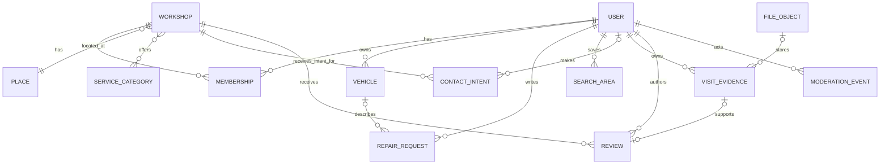

# Datenmodell und Berechtigungsgrenzen

Dieses Modell ergänzt [ADR-001](ADR-001.md). Es ist eine fachliche und technische Struktur für die Umsetzung, keine Aufbewahrungsfreigabe und keine Datenmigration. Alle IDs sind zufällige UUIDs; Zeitstempel liegen in UTC. PostgreSQL/PostGIS ist die einzige Quelle für Such- und Berechtigungsentscheidungen.

## Datenklassen

| Klasse | Darf öffentlich erscheinen | Beispiele | Schutz |
|---|---|---|---|
| Öffentlich freigegeben | Ja, nur nach Freigabe | Workshopname, freigegebene Leistungen, allgemeiner Standort, freigegebener Bewertungstext und Nachweisstatus | Separate öffentliche View; keine privaten Spalten mitselektieren. |
| Konto- und Betriebsprivat | Nein | OIDC-Subject, Membership, Rollenänderungen, Kontowiederherstellung | RLS, Fachservice und Audit-Ereignis. |
| Kundenprivat | Nein | Fahrzeug, Reparaturtext, Reisezeitraum, gespeichertes Suchgebiet, Kontaktabsicht | RLS nach Besitzer; nie in Karten-, Such- oder E-Mail-Request. |
| Besonders schützenswert | Nie | Besuchsnachweis, Bild/PDF, Prüfnotiz, Moderationsbegründung | Private Objektablage, kurzlebiger Zugriff, Quarantäne, Audit und dokumentierte Löschfrist. |

## Fachliche Entitäten

| Entität | Kernfelder | Sichtbarkeit und Regel |
|---|---|---|
| `User` | `id`, `oidc_subject`, `status`, `created_at`, `deleted_at` | Privat. `oidc_subject` ist eindeutig; E-Mail wird nicht als Autorisierungs- oder Fremdschlüssel verwendet. |
| `Workshop` | `id`, `name`, `publication_state`, `verification_state`, `place_id`, `contact_channels`, `published_at` | Öffentliche View nur bei `publication_state=published`. `verification_state` bedeutet ausschließlich Unternehmensdatenprüfung, nie Reparaturqualität. |
| `Membership` | `user_id`, `workshop_id`, `role`, `state`, `granted_by`, `granted_at` | Privat. Nur aktive Mitgliedschaft erlaubt Workshop-Verwaltung. Selbstregistrierung erzeugt nie eine aktive Membership zu bestehendem Workshop. |
| `ServiceCategory` | `id`, `parent_id`, `slug`, `label_de`, `label_sq`, `state` | Öffentlich lesbarer, administrativ gepflegter Katalog. Keine freien Kategorien in der Suche. |
| `Place` | `id`, `name`, `country_code`, `point geography(Point,4326)`, `source`, `status` | Öffentliche, geprüfte Ortsgrundlage. `source` dokumentiert eigene Prüfung; MapTiler-Suchergebnisse werden nicht persistiert. |
| `Vehicle` | `id`, `owner_user_id`, `make`, `model`, `year`, `notes`, `deleted_at` | Kundenprivat. Kein Kennzeichen und keine VIN, sofern für den MVP nicht ausdrücklich erforderlich und freigegeben. |
| `RepairRequest` | `id`, `owner_user_id`, `vehicle_id nullable`, `service_category_id`, `description`, `travel_window nullable`, `state` | Kundenprivat. Wird nicht automatisch an Werkstätten verteilt und ist kein Auftrag oder Angebot. |
| `SearchArea` | `id`, `owner_user_id nullable`, `point geography(Point,4326)`, `radius_m`, `label`, `expires_at` | Gast-Suche bleibt nur kurzlebig; gespeicherte Suche hat Besitzer und RLS. Mehrere Flächen sind eine Vereinigung, nicht mehrere Kontaktanfragen. |
| `ContactIntent` | `id`, `workshop_id`, `actor_user_id nullable`, `anonymous_key nullable`, `channel`, `created_at` | Privat und minimal. Dokumentiert nur die bewusst gewählte Kontaktabsicht; keine Nachricht, Telefonnummer, Buchung, Preis oder Reparaturdetails. Anonyme Schlüssel sind gehasht, rotierbar und befristet. |
| `VisitEvidence` | `id`, `owner_user_id`, `review_id nullable`, `evidence_kind`, `verification_state`, `private_file_id nullable` | Besonders schützenswert. Nur ein abgeleiteter Status kann bei einer Review erscheinen; Datei und Prüfnotiz bleiben privat. Werkstattbestätigung ist nur eine mögliche Evidenz, keine Voraussetzung für Kritik. |
| `Review` | `id`, `author_user_id`, `workshop_id`, `service_category_id`, `text`, `rating nullable`, `publication_state`, `evidence_status`, `moderation_state` | Öffentliche View nur nach Moderationsfreigabe. `evidence_status` ist keine Qualitätsgarantie und die Veröffentlichung negativer Kritik hängt nicht an einer Werkstattbestätigung. |
| `ModerationEvent` | `id`, `actor_user_id`, `subject_type`, `subject_id`, `event_type`, `reason_code`, `created_at` | Privat, append-only. Freitext und Beleginhalt getrennt und nur wenn fachlich nötig. |
| `FileObject` | `id`, `owner_scope`, `storage_key`, `content_type`, `size_bytes`, `scan_state`, `retention_state` | Privat. `storage_key` ist nicht öffentlich und enthält keine Namen oder Fahrzeugdaten. |
| `NotificationOutbox` | `id`, `kind`, `subject_id`, `payload_reference`, `state`, `attempt_count`, `next_attempt_at` | Privat. Enthält Referenzen statt privaten Mailinhalt; wiederholbare Zustellung ohne Event-Bus. |

## Beziehungen und Zustände

Erlaubte zentrale Zustände:

- `Workshop.publication_state`: `draft → pending_review → published → suspended → archived`.
- `Membership.state`: `invited → active → suspended → revoked`; nur `active` zählt.
- `Review.publication_state`: `draft → submitted → under_review → published | rejected | withdrawn`.
- `FileObject.scan_state`: `pending → clean | rejected | failed`; `pending` und `failed` sind niemals downloadbar.
- `NotificationOutbox.state`: `pending → sending → sent | retry | dead_letter`; eine E-Mail ist kein Nachweis für Handlung oder Besuch.

Alle Zustandsübergänge sind transaktional. Der Fachservice prüft erlaubten Vorgänger, schreibt die Änderung und fügt im selben Commit ein `ModerationEvent` oder Outbox-Ereignis ein. Wiederholung darf keinen zweiten Kontakt oder eine zweite Mail erzeugen.

## Geosuche und Relevanz

`Place.point` und die Workshopposition verwenden `geography(Point,4326)` mit GiST-Index. Für ein oder mehrere `SearchArea`-Objekte gilt:

1. Zuerst nur veröffentlichte Workshops mit passender `ServiceCategory` auswählen.
2. `ST_DWithin(workshop.point, search_area.point, search_area.radius_m)` serverseitig ausführen.
3. Bei mehreren Flächen per Workshop-ID deduplizieren. Ein Betrieb erscheint im Überlappungsbereich nur einmal.
4. Ergebnis erklärt die passenderen Kriterien in Textform. Entfernung, Leistung, freigegebene Unternehmensdaten und relevante Erfahrungen dürfen Einfluss haben; Abo, Zahlung, verwehrte Werkstattbestätigung oder Moderationsdruck nie.

PostGIS führt Entfernungen auf `geography` in Metern aus und kann räumliche Indizes für KNN-Suche verwenden. Eine fehlende oder ungültige Position ergibt keinen geschätzten Treffer. Radius ist Luftlinie und wird im UI so bezeichnet; Reisezeiten sind weder Routing-Daten noch Verfügbarkeitsbehauptungen.

## Serverseitige Berechtigungsmatrix

| Aktion | Gast | Customer | WorkshopMember | Moderator | Admin |
|---|---:|---:|---:|---:|---:|
| Öffentliche Suche und Profil lesen | Ja | Ja | Ja | Ja | Ja |
| Kontaktkanal bewusst wählen | Ja, rate-limitiert | Ja | Ja | Ja | Ja |
| Eigenes Fahrzeug, Anfrage, Suchgebiet verwalten | Nein | Nur eigene | Nein | Nein | Nur mit begründetem Supportvorgang |
| Workshopprofil ändern | Nein | Nein | Nur aktive eigene Membership und nur freigegebene Felder | Nein | Ja, auditierbar |
| Besuchsnachweis lesen oder laden | Nein | Nur eigener | Nie automatisch | Nur zugewiesener Fall | Begründet und auditierbar |
| Review einreichen | Nein | Eigene | Eigene, falls Rolle erlaubt | Nein | Nie im Namen eines Kunden |
| Review oder Meldung moderieren | Nein | Nein | Nein | Nur zugewiesener Umfang | Ja, auditierbar |
| Rolle vergeben oder entziehen | Nein | Nein | Nein | Nein | Ja, kein Self-Service |

Die Matrix wird zweimal durchgesetzt: Fachservice plus PostgreSQL-RLS. Öffentliche Suchendpunkte greifen auf dedizierte Views mit expliziter Spaltenliste zu. Private Endpunkte setzen `app.user_id` und bei Workshopaktionen zusätzlich eine verifizierte Membership in derselben Transaktion; ein ID-Wert aus URL oder Body reicht nie als Berechtigung.

## Dateien und Lebenszyklus

1. Der Server autorisiert Inhalt, Typ, Größe und Zielklasse vor jeder signierten Upload-URL.
2. Uploads landen in einem nicht lesbaren Quarantäne-Prefix. Erst nach Scan und atomarem Metadatenwechsel wird ein privates Objekt referenzierbar.
3. Downloads erhalten eine neue, eng befristete URL erst nach erneuter Objektprüfung. Die URL, der Dateiname und der Beleginhalt stehen nie im Audit- oder E-Mail-Log.
4. Löschung markiert erst fachlich `retention_state`, sperrt Zugriff und löscht nach der später rechtlich festgelegten Frist Objekt und Metadaten. Rechtliche Aufbewahrung und konkrete Fristen sind noch offen und werden nicht vorweggenommen.

## Szenarioprüfung

**Zwei Suchorte:** Ein Gast wählt Pristina 15 km und Prizren 30 km. Der Server erstellt zwei kurzlebige Flächen, führt eine unionierte PostGIS-Abfrage aus und dedupliziert nach `Workshop.id`. Der Gast übermittelt keine private Anfrage und keine Werkstatt erhält Daten.

**Privater Bewertungsnachweis:** Eine angemeldete Person lädt einen Nachweis in die Quarantäne. Nur nach sauberem Scan wird `VisitEvidence` privat referenziert. Der Review zeigt höchstens `evidence_status`; ein Moderator kann bei Bedarf den zugewiesenen Fall prüfen. Der Workshop sieht weder Datei noch Reise-/Fahrzeugdaten und kann eine negative Review nicht durch fehlende Bestätigung blockieren.

## Offene, vor Produktivstart zwingende Entscheidungen

- Rechtlicher Betreiber, Datenschutzhinweise, zulässige Nachweisarten und Aufbewahrungsfristen.
- DPA, Subprozessoren, Live-Preis, Kostenlimit und Zahlungsfreigabe aller gewählten Dienste.
- Senderdomain, Karten-Schlüsselrestriktionen, Backup-Verschlüsselungsschlüssel und erfolgreiche Restoreprobe.
- Konkrete Datensätze für Orte, Leistungen und Workshopaufnahme; keine Übernahme von Anbieter-Geocodingdaten entgegen deren Bedingungen.
